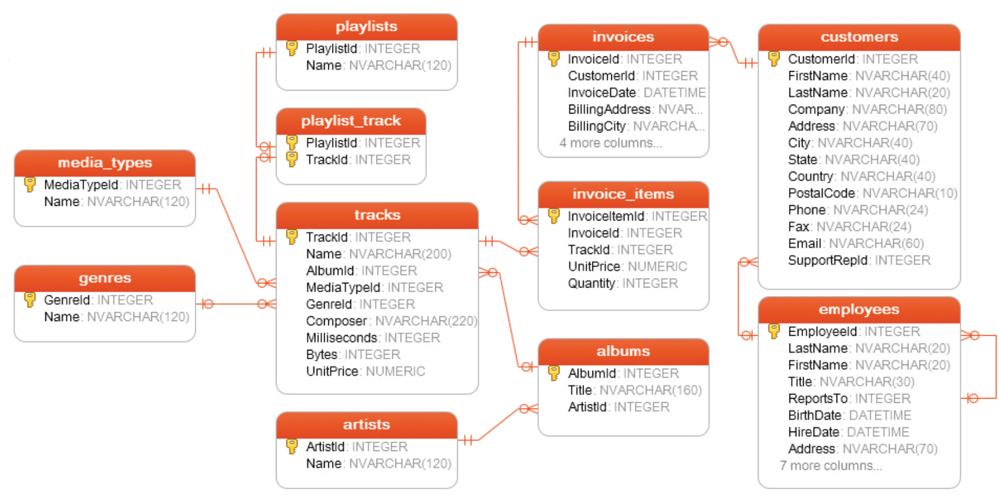

# Data Engineer - Technical Assessment

In this section of the interview at Beyond Finance, you will be assessed on your ability to perform several Data Engineering tasks. To perform well on these tasks, you will demonstate competence in the following areas:

* preprocessing data to prepare for a database load
* understanding entity relationships in a database
* merging data from different tables
* filtering data to relevant subsets
* calculating aggregations and descriptive statistics

It will be pretty difficult to complete all questions in the allotted time. Your goal is not to speed through the answers, but to come up with answers that demonstrate your knowledge. It's more about your thought process and logic than getting the right answer or your code.

## Getting Started

This exercise will be broken into 2 parts
1. Data Processing
2. Data Wrangling

### Data Processing
In this section you will take files from the ./raw_data/ subfolders, combine them into a single newline-delimited `json.gz` file per subfolder, and place that CSV file in a processed_data/ directory. You may have to do some light investigation into the data files to understand their file formats and delimiters

**Example**

Files
- ./raw_data/tracks/tracks_0.csv
- ./raw_data/tracks/tracks_1.json
- ./raw_data/tracks/tracks_2.csv
- etc... 

should be combined into a single file ./processed_data/tracks.json.gz

**What we look for**

- Can you handle all subfolders in a single pass over the raw data files?
- How can you limit memory consumption? (hint `chunksize`)

### Data Wrangling
For this section, we'll pretend you loaded the raw data plus additional tables into a small SQLite database containing roughly a dozen tables. **We've provided this database for you so don't worry about loading it yourself**. If you are not familiar with the SQLite database, it uses a fairly complete and standard SQL syntax, though does not many advanced analytics functions. Consider it just a remote datastore for storing and retrieving data from. 

## Data Processing (40 minutes)
Process the files in ./raw_data/ to combine them into a single json.gz file per subfolder

**Example**

Files
- ./raw_data/tracks/tracks_0.csv
- ./raw_data/tracks/tracks_1.json
- ./raw_data/tracks/tracks_2.csv
- etc... 

should be combined into a single file ./processed_data/tracks.json.gz

## Data Wrangling (20 minutes)

1. How many different customers are there?
2. How long is the longest track in minutes?
3. Which genre has the shortest average track length?
4. Which artist shows up in the most playlists?
5. What was the most popular album among these customers?
